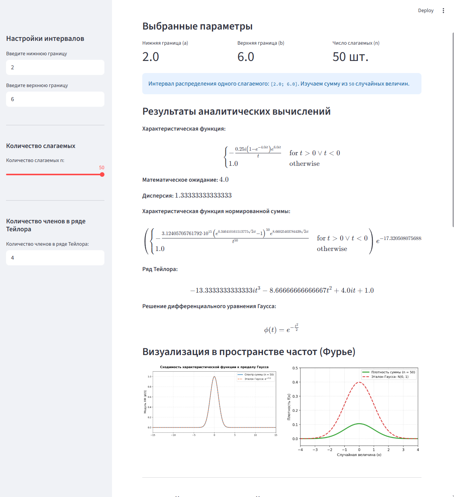

# Интерактивный дашборд 

Интерактивный дашборд, который визуализирует и доказывает **Центральную предельную теорему (ЦПТ)** не экспериментальным моделированием, а через сходимость операторов в пространстве частот.


# Цель проекта 

Визуализировать и доказать Центральную предельную теорему в пространстве частот Фурье. Показать, как спектр любой случайной величины при многократном сложении математически неизбежно трансформируется в форму нормального распределения Гаусса проходя через ОДУ, интегралы и ряды Тейлора. 


## Математический аппарат проекта

Проект раскрывает фундаментальную связь между теорией вероятностей и гармоническим анализом:

### 1. Прямое преобразование Фурье
Характеристическая функция $\varphi_X(t)$ случайной величины с плотностью $f_X(x)$ вычисляется как прямое преобразование Фурье:
$$\varphi_X(t) = \mathbb{E}[e^{itX}] = \int_{-\infty}^{+\infty} f_X(x) e^{itx} dx$$

Для равномерного распределения $U[a, b]$ аналитический интеграл принимает вид:
$$\varphi_X(t) = \frac{e^{itb} - e^{ita}}{it(b-a)}$$

### 2. Операторный метод (Моменты распределения)
Поиск моментов случайной величины реализован через символьное вычисление производных характеристической функции в окрестности нуля ($t \to 0$):
* **Математическое ожидание:** $\mathbb{E}[X] = \frac{1}{i} \cdot \lim_{t \to 0} \frac{d\varphi_X(t)}{dt}$
* **Второй начальный момент:** $\mathbb{E}[X^2] = \frac{1}{i^2} \cdot \lim_{t \to 0} \frac{d^2\varphi_X(t)}{dt^2}$
* **Дисперсия:** $\mathbb{D}[X] = \mathbb{E}[X^2] - (\mathbb{E}[X])^2$

### 3. Ряд Тейлора
Аппроксимация сложных тригонометрических характеристических функций в полиномы в окрестности нуля для демонстрации структуры моментов:
$$\varphi_X(t) = 1 + it\mathbb{E}[X] - \frac{t^2}{2}\mathbb{E}[X^2] + o(t^2)$$

### 4. Закон ЦПТ (Сжатие и сдвиг)
Для стандартизированной суммы $Z_n = \frac{\sum X_k - n\mu}{\sigma\sqrt{n}}$ спектр вычисляется за счет мультипликативности ХФ независимых событий:
$$\varphi_{Z_n}(t) = \left[ \varphi_X\left(\frac{t}{\sigma\sqrt{n}}\right) \right]^n \cdot e^{-\frac{it n \mu}{\sigma\sqrt{n}}}$$

### 5. Дифференциальное уравнение (ОДУ Гаусса)
Доказывается, что при $n \to \infty$ спектр $\varphi_{Z_n}(t)$ сходится к функции $\varphi(t) = e^{-t^2/2}$, которая является единственным решением ОДУ первого порядка:
$$\frac{d\varphi}{dt} + t\varphi = 0, \quad \text{при } \varphi(0) = 1$$

### 6. Обратное преобразование Фурье
Для возвращения из пространства частот в реальный мир и восстановления итогового «колокола» плотности вероятности $f_{Z_n}(x)$ применяется интеграл обратного преобразования Фурье, реализованный в коде через матричные операции:
$$f_{Z_n}(x) = \frac{1}{2\pi} \int_{-\infty}^{+\infty} \varphi_{Z_n}(t) e^{-itx} dt \approx \frac{1}{2\pi} \sum_{j} \varphi_{Z_n}(t_j) e^{-it_j x} \Delta t$$

---


# Последовательность работы приложения 

1. Ввод данных пользователем 
- Выбор параметров границ $[a, b]$ непрерывной случайной величины.
- Динамическое управление количеством слагаемых величин ($n$)
- Количество членов ряда Тейлора 
2. Аналитический блок 
- Расчет прямой ХФ, разложение в ряд Тейлора, аналитическое решение ОДУ Гаусса через `SymPy`.
3. Визуализация аналитики 


## Возможности проекта

* **Чистая символьная математика** 
* **Высокопроизводительный матанализ:** Численное обратное преобразование Фурье реализовано без циклов с помощью механизмов транслирования матриц (`broadcasting`) в `NumPy`, что обеспечивает мгновенный рендеринг графиков.
* **Защита от неопределенностей:** Математическое ядро устойчиво к точкам разрыва ($t=0$) благодаря разделению аналитического и числового вычисления моментов.


## Технологии 
* **Python**
* **SymPy**
* **NumPy**
* **Matplotlib**
* **Streamlit**


## Пример работы 




## Запуск

1. Клонируйте репозиторий проекта 
```bash
git clone https://github.com/Leonid2005ponchik/Fourier-CLT-Prover
cd Fourier-CLT-Prover 
```

2. Установите зависимости:
```bash
pip install -r requirements.txt
```
3. Запустите дашборд:
```bash
streamlit run main.py
```

## Автор
[Леонид Агарков](https://github.com/Leonid2005ponchik)


